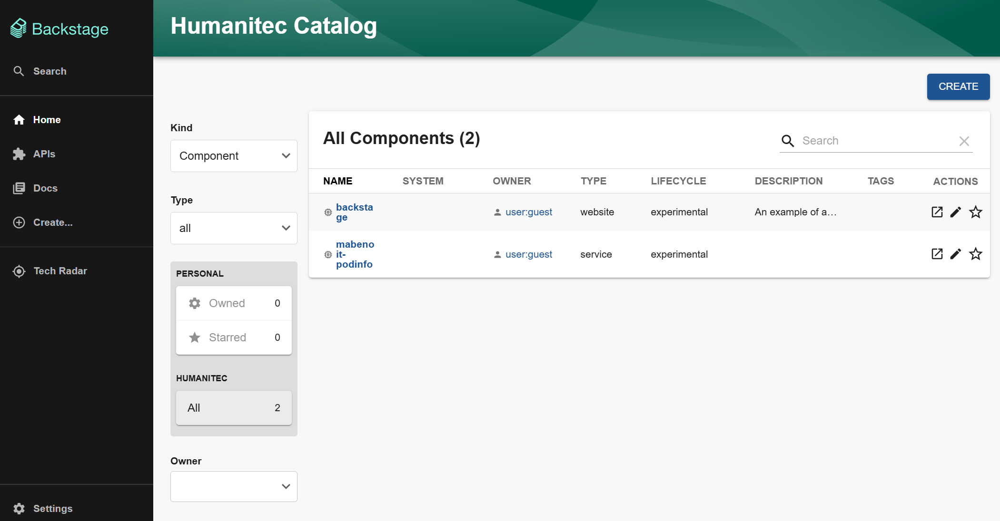
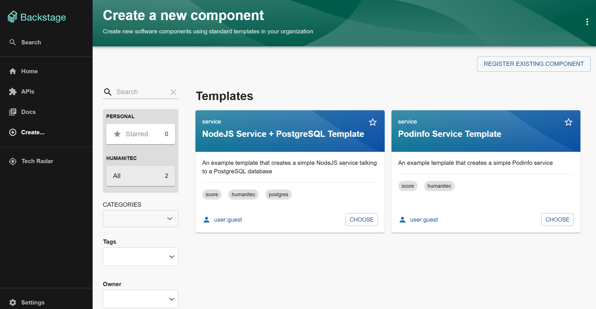
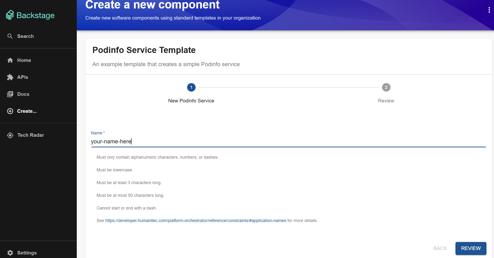
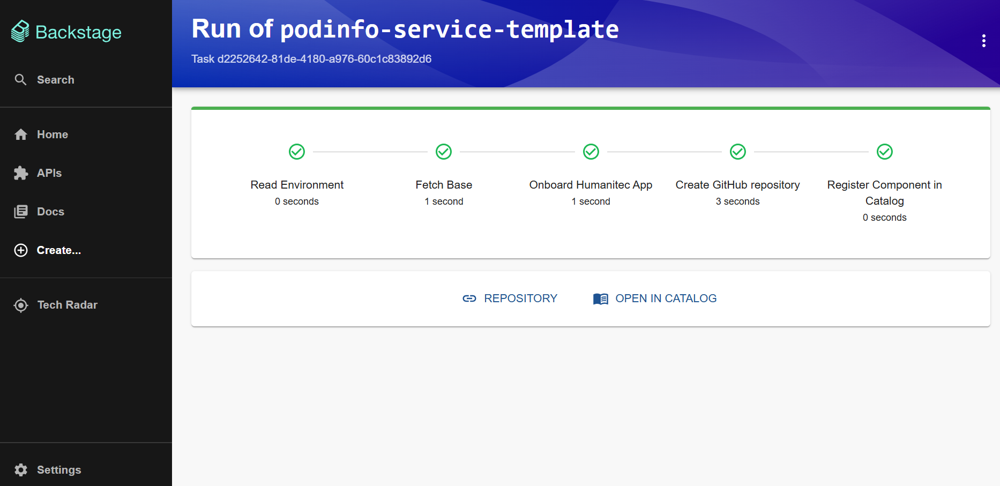
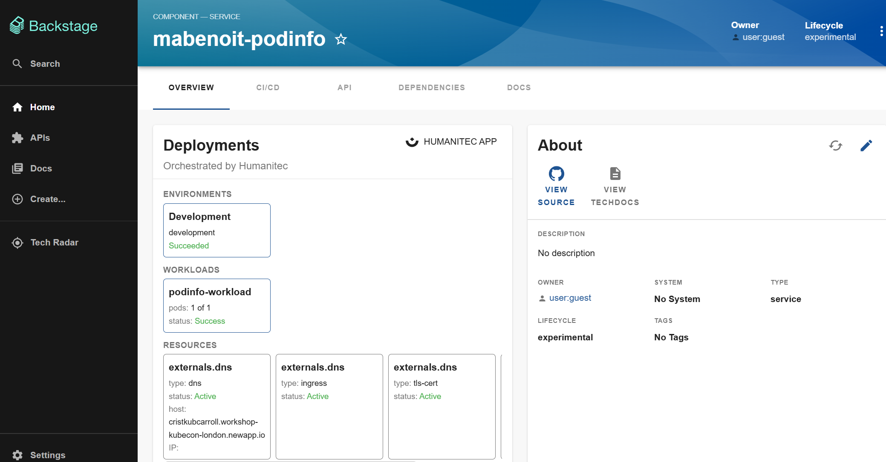

# Onboard a new project from Backstage

Prerequisites:
- You need a web browser.

Context: You are a Developer and you want to onboard a new Project in the Platform based on available templates.

Objectives:
- From your Developer Portal, you will onboard a new project based on well supported templates.

Go to https://collinsstoltenbergmckenziewatsica.workshop-kubecon-london.newapp.io/. Enter as a Guest user.

Click on `Create` in the top right corner.

Select one of the 2 templates, by clicking on `Choose` on one of them.

_Important note: please make this name unique (otherwise you'll get an error)._

Provide a `Name`.

Click on `Review` and then `Create`.

Let's highlight what just happened, what was just created?

A template was provided and design to onboard a new project and:
- Trigger a GitHub Action that will create the Humanitec Application (project)
- Create a GitHub Repository with the project template cloned. 

See more details about this template [here](https://github.com/humanitec-architecture/backstage-catalog-templates/blob/main/node-service/template.yaml).

Then click on `Open in catalog`.

On the `Deployments` section, you can click on the `Development` environment to expand the Workloads and Resources deployed.

_Note: the deployment could take some times, so just wait a little bit until you see the status as `Succeeded`._

| [Next: Set up your local environment >>](codespace.md)
