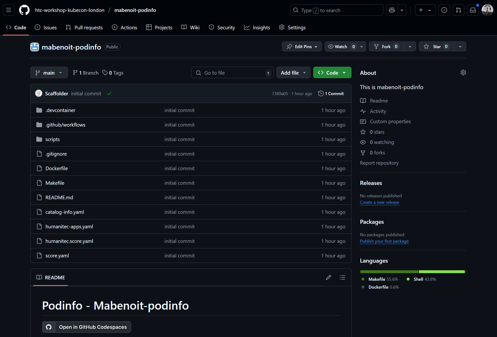

# Set up your local environment

Prerequisites:
- You need to have successfully done the previous section [Onboard a new project from Backstage](backstage.md)
- You need a web browser (GitHub Codespace will be used).
- You need a GitHub account.
- You need to be logged in to your Humanitec Organization at [https://app.humanitec.io/](https://app.humanitec.io/)

Context: You are a Developer and you want to download the GitHub repository created in order to author and test your source code.

Objectives:
- [Open your GitHub repository with Codespace](#open-your-github-repository-with-codespace)
- [Run your Workload locally with `score-compose`](#run-your-workload-locally-with-score-compose)
- [Interact with your Platform to see status of current deployment in Development](#interact-with-your-platform-to-see-status-of-current-deployment-in-development)

## Open your GitHub repository with Codespace

From Backstage, on your own Component you just created in the Service Catalog, click on `View source`.


This will open the GitHub repository created for your project.

Click on the `Open in GitHub Codespaces` badge at the top of the `README.md` file.



Leave the default values selected, and click on `Create codespace`.


Wait for your Codespace to be fully provisioned. This could take a few minutes.

You can now browse the source code of your project.


Open the `score.yaml` file.

Let's highlight the different sections and concepts.

## Run your Workload locally with `score-compose`

Generate the Docker Compose services to run your Workload locally, from the Score file:
```bash
score-compose init --no-sample

CONTAINER_NAME=$(yq '.containers | keys[0]' score.yaml)

score-compose generate score.yaml --build "${CONTAINER_NAME}={\"context\":\".\",\"tags\":[\"${CONTAINER_NAME}:test\"]}"
```

A `compose.yaml` file has now been created.

Run the Workload locally:
```bash
docker compose up --build -d --remove-orphans
```

Look at what was deployed:
```bash
docker ps

score-compose resources list
```

Test the deployed Workload:
```bash
WORKLOAD_NAME=$(yq '.metadata.name' score.yaml)

curl $(score-compose resources get-outputs dns.default#${WORKLOAD_NAME}.dns --format '{{ .host }}:8080')
```

Let's highlight what we just did, nothing related to Humanitec yet.

## Interact with your Platform to see status of current deployment in Development

Connect your Humanitec VS Code extension to your Humanitec Organization by running the `> Humanitec: Login` command in the VS Code search bar at the top (`Ctrl` + `Shift` + `P`):


Click `Open` on the popup, and then click on `Authorize humctl` on the page:


Use the email address you provided to register to this workshop.

In VS Code, run the `> Humanitec: Focus on Organization structure View` command in the VS Code search bar at the top (`Ctrl` + `Shift` + `P`). From there select your Humanitec App and the `Development` environment, and right-click to select `Set in workspace`:


Once selected you should now see the `Available resources` view populated:


Let's illustrate what does that mean:
- Where does this `Development` environment come from?
- What are these `Available resources`?

In VS Code, run the `> Humanitec: Open configured terminal` command in the VS Code search bar at the top (`Ctrl` + `Shift` + `P`). And run the following commands in this terminal.

```bash
humctl config
```
To show the current context.

```bash
humctl score validate score.yaml
```

```bash
humctl score available-resource-types
```

```bash
humctl get envs
```

```bash
humctl get active-resources
```

In VS Code, run the `> Humanitec: Display resource graph` command in the VS Code search bar at the top (`Ctrl` + `Shift` + `P`).


You can also run the following command to get the URL of the resource graph of the latest deployment. `Ctrl`+ click the link shown in the console to open it in a new tab in your web browser:
```bash
humctl resources graph deploy .
```

[<< Previous: Onboard a new project from Backstage](backstage.md) | [Next: Test a feature request >>](pr.md)
