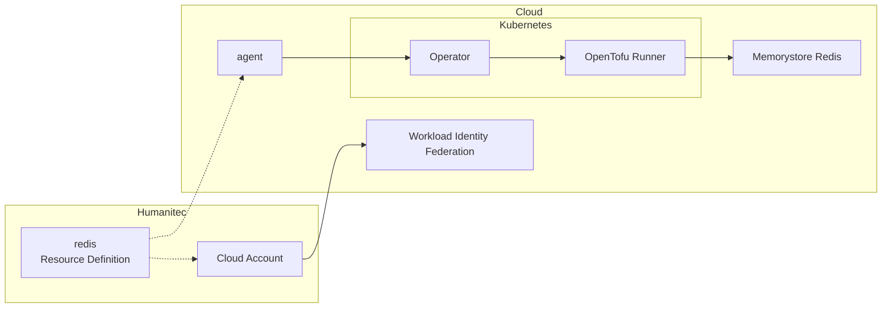
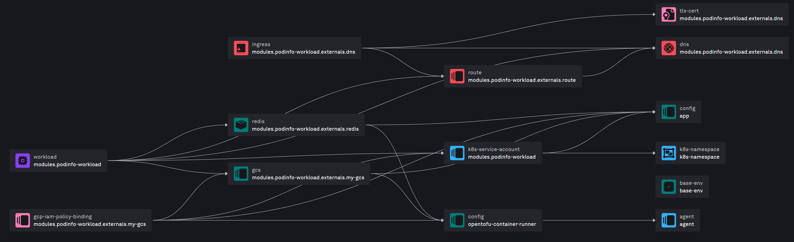

# Bring your own OpenTofu modules

Objectives:
- [Review the architecture](#review-the-architecture)
- [Add `gcs` with Workload Identity in Production](#add-gcs-with-workload-identity-in-production)
- [Review the in-cluster `redis` resource in Test](#review-the-in-cluster-redis-resource-in-test)
- [Review the `redis` (Memorystore via OpenTofu) resource in Production](#review-the-redis-memorystore-via-opentofu-resource-in-production)
- [Review the `gcs` (via OpenTofu) with Workload Identity in Production](#review-the-gcs-via-opentofu-with-workload-identity-in-production)

## Review the architecture

As Platform Engineer, you were able to setup access to Google Cloud to support the deployments of infrastructure dependencies on behalf of the Developers. It was done for you prior to this workshop.

Here is a zoom on this part of the setup:


## Add `gcs` with Workload Identity in Production

In this section we will manually deploy in Production environment a new Score file version by adding a `gcs` resource.

_Note: in reality, you won't do that from your local machine, but you will integrate this in your own CI/CD pipelines. Here it's just an illustration for you to practice and learn about the concepts._

Create a new `production` environment:
```bash
humctl create env production --type production --from test
```

Update the `score.yaml` file with the following changes:
```diff
...
containers:
...
    variables:
      ...
+      GCS_BUCKET_NAME: "${resources.my-gcs.name}"
resources:
+ my-gcs:
+   type: gcs
 my-redis:
   type: redis
  dns:
    type: dns
...
```

Let's deploy this new version of the Score file with an existing container image:
```bash
CONTAINER_IMAGE=$(humctl get deployment-set . -o yaml | yq '.entity.modules[].spec.containers[].image')

humctl score deploy -f score.yaml --env production --image ${CONTAINER_IMAGE}
```

We are not waiting for the end of this deployment, let's continue the workshop with the next section while it's deploying, we will illustrate what's going on with this deployment later in this page.

## Review the in-cluster `redis` resource in Test

```bash
humctl resources graph deploy . --env test
```

Select the `redis` node and check the detailed information.

See the associated resource definition configuration:
```bash
humctl get res-def redis-in-cluster -o yaml
```

## Review the `redis` (Memorystore via OpenTofu) resource in Production

Let's now look at the Production environment we just deployed earlier.

At this stage, the deployment should be done and successful.

Let's confirm this:
```bash
humctl get deploy . --env production -o yaml
```

Also, let's open the associated resource graph:
```bash
humctl resources graph deploy . --env production
```



Select the `redis` node and check the detailed information. What do you see? Any differences with previous configuration in `test` environment?

See the associated resource definition configuration:
```bash
humctl get res-def redis-memorystore-existing -o yaml
```

## Review the `gcs` (via OpenTofu) with Workload Identity in Production

On the previous graph opened, select the `gcs` node and check the details information and dependencies. What do you see?

See the associated resource definition configuration:
```bash
humctl get res-def gcs -o yaml
```

We could see that this `gcs` resource co-provisions an associated `gcp-iam-policy-binding`, this is to automatically inject GKE Workload Identity.

See the associated resource definition configuration:
```bash
humctl get res-def gcs-member -o yaml
```

[<< Previous: Review of the Platform setup](platform.md)