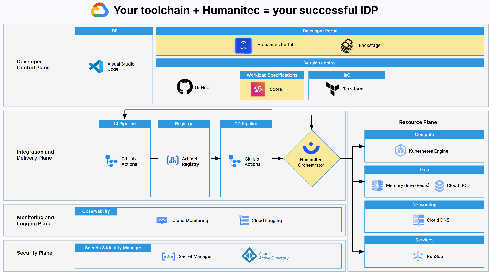

# Review of the Platform setup

Objectives:
- Review the reference architecture
- Understand what is a resource definition
- Illustrate some resource definition examples
- Manage Version and Usage of the resource definitions



As Platform Engineer, you were able to onboard existing Kubernetes clusters to support the deployments of the Developers and their projects. It was done for you prior to this workshop.

Here is a zoom on this part of the setup:


Let's look at the resource definition of type `k8s-cluster`:
```bash
humctl get res-defs workshop-kubecon-london -o yaml
```

You can onboard as many clusters as you want: per projects, per environments, etc. You will define this part in the `criteria` section.

At this stage, you may have noticed that everything building the resource graph of a deployment is a resource definition. Let's hightlight the important concepts of a resource definition:
- The "What?" --> `type`
- The "How?" --> `driver_type` with `driver_inputs`
- The "When?" --> `criteria`

Let's highlight the differences between "explicit" versus "implicit" resources on a specific deployment, open this link to illustrate this:
```bash
echo -e "https://app.humanitec.io/orgs/workshop-kubecon-london/apps/mabenoit-podinfo/envs/development/status"
```

Let's now open the resource definition of type `k8s-namespace` to see how you can enforce some `annotations` or `labels` with any Kubernetes `Namespace` created via the Platform:
```bash
humctl get res-defs secure-namespace -o yaml
```

Let's highlight what's defined in there to enforce as an example the `pod-security.kubernetes.io/enforce: restricted` label.

Let's now open the resource definition of type `workload` to see how you can enforce some `securityContext` features like `runAsNonRoot` with any workload deployed in Kubernetes via the Platform:
```bash
humctl get res-defs custom-workload -o yaml
```

Last but not least, let's illustrate the notion of "Version" and "Usage" of a resource definition. Let's open the `k8s-cluster` resource definition:
```bash
echo -e "https://app.humanitec.io/orgs/workshop-kubecon-london/resources/definitions/workshop-kubecon-london/usage"
```

| [Next: Bring your own OpenTofu modules >>](opentofu.md)
