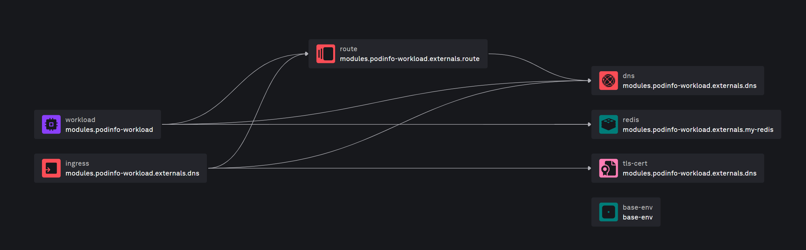
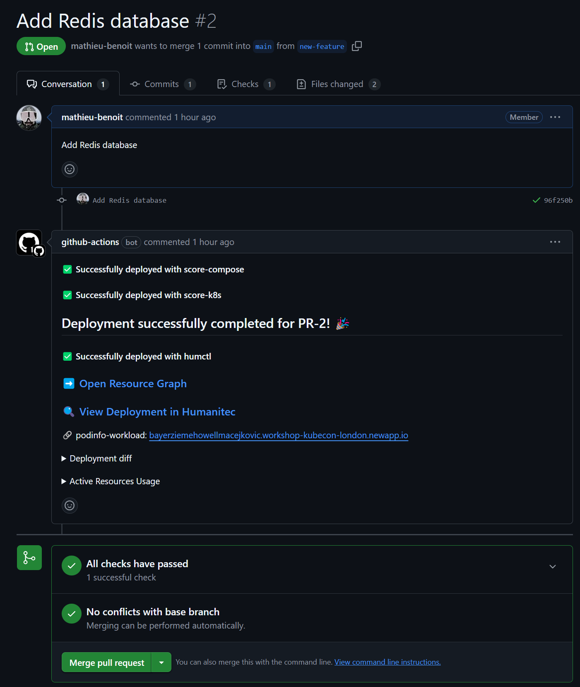

# Test a feature request

Prerequisites:
- You need to have successfully done the previous section [Set up your local environment](codespace.md)
- You need to have the Codespace created

Objectives:
- [Deploy manually a new deployment in a new environment](#deploy-manually-a-new-deployment-in-a-new-environment)
- [(Just a demo) See how an Ephemeral Environment can be created via a Pull Request](#create-an-ephemeral-environment-via-a-pull-request)

## Deploy manually a new deployment in a new environment

Create a new `test` environment:
```bash
humctl create env test --type development --from development
```

Because we just created this new `test` environment, we don't have any deployment in there yet:
```bash
humctl get deploy . --env test
```

Update the `score.yaml` file with the following changes:
```diff
...
containers:
...
    variables:
      ...
+      REDIS_ADDR: "${resources.my-redis.host}:${resources.my-redis.port},user=${resources.my-redis.username},password=${resources.my-redis.password}"
resources:
+ my-redis:
+   type: redis
  dns:
    type: dns
...
```

Let's deploy this new version of the Score file with an existing container image:
```bash
CONTAINER_IMAGE=$(humctl get deployment-set . -o yaml | yq '.entity.modules[].spec.containers[].image')

humctl score deploy -f score.yaml --env test --image ${CONTAINER_IMAGE} --wait
```

Once the deployment is done, let's check the diff between the two environments:
```bash
humctl diff sets env/test env/development
```

Also, let's open the new resource graph on this `test` environment and see that the Redis database is now provisioned:
```bash
humctl resources graph deploy . --env test
```



## (Just a demo) See how an Ephemeral Environment can be created via a Pull Request

_Important note: this section is just a demo, please see what your presenter is doing to illustrate this. You are not able to perform this specific section because you are not `Owner` in the GitHub Organization used during this workshop._

Create a `new-feature` branch:
```bash
git checkout -b new-feature
```

Commit your local changes in this `new-feature` branch:
```bash
git add score.yaml
git commit -m "Add Redis database"
git push -u origin new-feature
```

Create a dedicated Pull Request in GitHub:
```bash
gh pr create --title "Add Redis database" --body "Add Redis database"
```

Check the status of this Pull Request:
```bash
gh pr status

gh run list
```

Open this Pull Request in GitHub:
```bash
gh pr view --web
```



From there, let's highlight what happened, and what the associated GitHub Actions pipeline did.

[<< Previous: Set up your local environment](codespace.md) | [Next: Review of the Platform setup >>](platform.md)